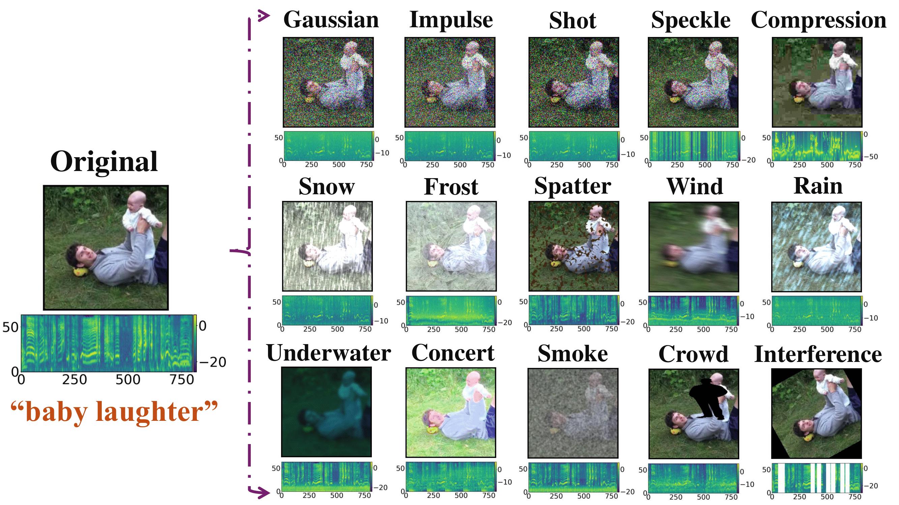

<div align="center">

# $\texttt{AVROBUSTBENCH}$: Benchmarking the Robustness of Audio-Visual Recognition Models at Test-Time

<em> [Sarthak Kumar Maharana](https://sarthaxxxxx.github.io/), [Saksham Singh Kushwaha](https://sakshamsingh1.github.io/), [Baoming Zhang*](https://www.linkedin.com/in/baoming-zhang-286083313/), [Adrian Rodriguez*](https://axr2718.github.io/), [Songtao Wei](https://www.linkedin.com/in/songtao-wei/), [Yapeng Tian](https://www.yapengtian.com/), and [Yunhui Guo](https://yunhuiguo.github.io/) </em>

The University of Texas at Dallas, Richardson, TX, USA

✍🏻 [Paper](https://arxiv.org/abs/2506.00358) 🗃️ [Datasets](https://huggingface.co/datasets/sakshamsingh1/av_robust_data/tree/main) 👾 [Demo](https://www.youtube.com/watch?v=hYdcRO3BuIY&ab_channel=SarthakMaharana)
</div>

## Introduction 🗣️

<div align="center">
  
</div>


While recent audio-visual recognition models have demonstrated impressive performance, their robustness to distributional shifts at test-time remains not fully understood. Existing robustness benchmarks mainly focus on single modalities, making them insufficient for thoroughly assessing the robustness of audio-visual models. Motivated by real-world scenarios where shifts can occur $\textit{simultaneously}$ in both audio and visual modalities, we introduce $\texttt{AVROBUSTBENCH}$, a comprehensive benchmark designed to evaluate the test-time robustness of audio-visual recognition models. Specifically, we introduce 75 AV corruptions that $\textit{co-occur}$ and are $\textit{correlated}$ across both modalities, enabling a large-scale assessment of these models’ resilience to challenging, realistic shifts. It is worth emphasizing
that the unique challenge in $\texttt{AVROBUSTBENCH}$ arises from the real-time occurrence of correlated corruptions that simultaneously affect both the audio and visual modalities. Benchmarking and the robustness of audio-visual models to real world distributional shifts at test-time deserves attention and will hopefully serve as a valuable foundation for future research.


## Code, Datasets, and Demo 🛠️

We release the code and datasets comprising $\texttt{AVROBUSTBENCH}$. We propose four audio-visual datasets, $\texttt{AUDIOSET-2C}$, $\texttt{VGGSOUND-2C}$, $\texttt{KINETICS-2C}$, and $\texttt{EPICKITCHENS-2C}$. These datasets span diverse domains, environments, and action categories, offering a broad and realistic evaluation suite for audio-visual recognition models. 

We construct our datasets by introducing our proposed corruptions to the test sets of AudioSet, VGGSound, Kinetics-Sounds, and Epic-Kitchens. $\texttt{AUDIOSET-2C}$ contains 16,742 audio-video test pairs. Each clip is roughly 10s and spans 527 classes. $\texttt{VGGSOUND-2C}$ contains 14,046 test pairs. $\texttt{KINETICS-2C}$ contains 3,111 clips across 32 classes, each around 10s long. $\texttt{EPICKITCHENS-2C}$ has 205 egocentric video clips capturing daily kitchen tasks of an average duration of 7.4 mins each.

To download our datasets, we have released them on Huggingface. This [link](https://huggingface.co/datasets/sakshamsingh1/av_robust_data/tree/main) will redirect you there.

For a better audio-visual experience, our YouTube demo is [here](https://www.youtube.com/watch?v=hYdcRO3BuIY&ab_channel=SarthakMaharana).


## Steps to introduce our proposed audio-visual corruptions 🚀
`dataset.py` contains the code that takes any audio-visual datasets and adds any of the corruptions at any severity level that we released. The file is modular, allowing anyone to modify it for their datasets and their models. `/corruptions` contains the code for each of the corruptions, their severity levels, the images to create corrupted images, and the audio to create corrupted audios. 

### Set up the environment
This repo requires Python 3.10>. Create an environment and run `pip install -r requirements.txt` before continuing.

### Extract frames and audio from the videos
To extract the frames and audio from the videos on the dataset, please refer to this [repo](https://github.com/YuanGongND/cav-mae/tree/master/src/preprocess) for instructions of how to extract them. After following those instructions, you should have directories that contain image frames and audio files for videos.

### Setting up the json file
To begin, you will be required to create a json file for your dataset containing its wav path, labels, video ID, and video path. For example, `BkjpjAohg-0` is the video ID for a file `BkjpjAohg-0.mp4`. The video path is the directory containing the frames for the video ID. As an example, using AudioSet:

```json
{
    "data": [
        {
            "wav": "/home/adrian/Data/AudioSet/eval_audio/BkjpjAohg-0.wav",
            "labels": "/m/04rlf,/m/07pjwq1,/m/07s72n,/m/08cyft",
            "video_id": "BkjpjAohg-0",
            "video_path": "/home/adrian/Data/AudioSet/eval_frames"
        },
        {
            "wav": "/home/adrian/Data/AudioSet/eval_audio/4ufZrEAJnJI.wav",
            "labels": "/m/0242l",
            "video_id": "4ufZrEAJnJI",
            "video_path": "/home/adrian/Data/AudioSet/eval_frames"
        }]
}
```

The dataset json file need not follow this structure. Modify it for your needs. If you modify the json file, you will need to modify `dataset.py`. Note that the dataset file does not contain any logic for labels, as different datasets have different label structures. A user can easily modify our code to add their relevant metadata, labels, and any other corruptions. Our dataset makes it easy to get an image/audio pair from their dataset and add a corruption to both modalities. 


Create a json path and pass this into the dataset class. We provide a `create_json.py` as a reference of how to create the json file. `/assets` contains a video, frames, audio, label metadata, and json.

### Using the dataset 
Below is the code to use the dataset. The possible corruptions are `gaussian`, `impulse`, `shot`, `speckle`, `compression`, `snow`, `frost`, `spatter`, `wind`, `rain`, `underwater`, `concert`, `smoke`, `crowd`, and `interference`. The `severity` is an integer between 1 and 5.


```python
from dataset import AVRobustBench
file_path = 'path/to/your/json'
dataset = AVRobustBench(file_path, corruption='gaussian', severity=5, frame_num=4, all_frames=False)
```

Each entry in `AVRobustBench` contains an `(frames, audio)` tuple with the option of adding corruptions on them. `frames` is a list of PIL images if `all_frames=true` or a list with a singular image, while `audio` is a BytesIO .wav file-like. PIL images are the standard, but there is no standard for audio files. Some codebases use `torchaudio`, `librosa`, `soundfile`, or something else. Due to `audio` being a .wav file-like stored in memory, it can be passed as a .wav to any audio library.

### Creating a corrupted video
Additionally, we provide a static function in `AVRobustBench` that allows a user to input an mp4 video file path, add the visual and audio corruptions to the video, then allow for displaying or saving this video to preprocess if required. The video is stored in memory as a BytesIO but can be saved in disk with the parameter `save_path`. Below is the code to create corrupted videos.

```python
from dataset import AVRobustBench
video_path = 'path/to/your/video'
corrupted_path = 'path/to/your/corrupted/video'
corrupted_video = AVRobustBench.create_video(video_path, corruption="spatter", severity=5, save_path=corrupted_path)
```

`demo.ipynb` showcases a few examples of using the dataset.
